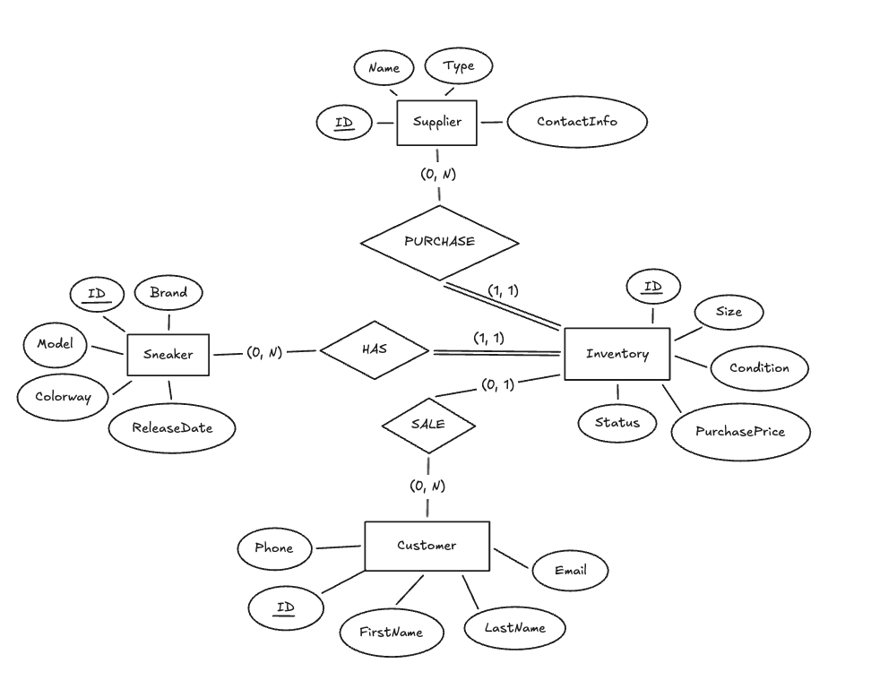

# SneakerVault: A Database-Driven Inventory Management System

CS 4347 - Database Systems, Spring 2026, The University of Texas at Dallas

**Instructor:** Jalal Omer

**Team 10:**
Awsaf Ahmad Kabir (AAK220007)

Giridhar Nair (GXN210004)

Rafael Tobar (RAT240001)

Lino Vega (LAV240000)

Shaikh Hamid (SHH220001)

<pdf:nextpage />

## Table of Contents

1. Introduction
2. Requirements Analysis
3. Logical Database Design
4. Database Implementation
5. Application and User Interfaces
6. Results
7. Conclusion and Future Work
8. References

<pdf:nextpage />

## 1. Introduction

Independent sneaker resellers typically track inventory, purchases, and sales using spreadsheets. As a business grows, spreadsheets become error-prone: duplicate entries appear, there is no enforcement of relationships between sales and inventory, and generating financial reports requires manual effort. SneakerVault replaces this workflow with a relational database and a web-based management interface.

The system manages five entities: sneaker models, physical inventory items, suppliers, customers, and purchase prices. It exposes a REST API that a browser-based front end uses to perform all create, read, update, and delete operations. Referential integrity is enforced at the database level through foreign key constraints, and all data is validated server-side before being committed.

The back end is written in Python using Flask. The database is SQLite. The front end is plain HTML, CSS, and JavaScript with no external libraries.

<pdf:nextpage />

## 2. Requirements Analysis

The primary user is a small-business owner who purchases limited-edition sneakers and resells them. The system must allow that user to catalog sneaker models, record incoming stock linked to a supplier, search and filter inventory, record a sale by linking an inventory item to a customer, and view summary reports.

The following constraints were identified. An inventory item must reference a valid sneaker model and a valid supplier; both are required. Purchase price is a property of the sneaker, size, and condition combination, not of any single inventory item, so it is stored in a separate relation. An item's status may only be one of Available, Reserved, or Sold, enforced by a CHECK constraint. Deleting a sneaker or supplier that is referenced by an inventory item is rejected by the database. If a customer record is deleted, the CustomerID on any linked inventory item is set to NULL rather than deleting the inventory record.

<pdf:nextpage />

## 3. Logical Database Design

### 3.1 ER Diagram

Five entities were identified: Sneaker, Supplier, Customer, Inventory, and PurchasePrice.

A Sneaker represents a product variant defined by brand, model, and colorway. A Supplier is an entity from which stock is acquired. A Customer is someone who purchases a resold item. An Inventory record is one physical item currently or previously in stock. PurchasePrice captures the cost basis for a particular Sneaker, Size, and Condition triple, because the same sneaker may be purchased in different sizes or conditions at different prices.

Inventory has a many-to-one relationship with Sneaker and a many-to-one relationship with Supplier, both with total participation. Inventory has a many-to-one relationship with Customer with partial participation, since CustomerID is null until the item is sold. PurchasePrice has a many-to-one relationship with Sneaker with total participation. Inventory is also related to PurchasePrice through the composite foreign key (SneakerID, Size, Condition), ensuring every item's cost is on record.



### 3.2 Relational Schema

    Sneaker(ID, Brand, Model, Colorway, ReleaseDate)
      PK: ID
      UNIQUE: (Brand, Model, Colorway)

    Supplier(ID, Name, Type, ContactInfo)
      PK: ID
      UNIQUE: ContactInfo

    Customer(ID, FirstName, LastName, Email, Phone)
      PK: ID
      UNIQUE: Email

    PurchasePrice(SneakerID, Size, Condition, PurchasePrice)
      PK: (SneakerID, Size, Condition)
      FK: SneakerID -> Sneaker(ID)  ON DELETE RESTRICT  ON UPDATE CASCADE

    Inventory(ID, SneakerID, SupplierID, Size, Condition, Status, CustomerID)
      PK: ID
      FK: SneakerID                    -> Sneaker(ID)
          ON DELETE RESTRICT  ON UPDATE CASCADE
      FK: SupplierID                   -> Supplier(ID)
          ON DELETE RESTRICT  ON UPDATE CASCADE
      FK: CustomerID                   -> Customer(ID)
          ON DELETE SET NULL  ON UPDATE CASCADE
      FK: (SneakerID, Size, Condition) -> PurchasePrice(SneakerID, Size, Condition)
          ON DELETE RESTRICT  ON UPDATE CASCADE
      CHECK: Status IN ('Available', 'Reserved', 'Sold')

### 3.3 Normalization

The initial design placed PurchasePrice inside the Inventory relation:

    Inventory(ID, SneakerID, SupplierID, Size, Condition, Status, PurchasePrice, CustomerID)

This produces the following functional dependencies:

    ID -> SneakerID, SupplierID, Size, Condition, Status, PurchasePrice, CustomerID
    (SneakerID, Size, Condition) -> PurchasePrice

**1NF and 2NF** are satisfied. All attributes are atomic, there are no repeating groups, and every non-key attribute depends on the full primary key.

**3NF violation.** The dependency (SneakerID, Size, Condition) -> PurchasePrice is a transitive dependency through the primary key:

    ID -> (SneakerID, Size, Condition) -> PurchasePrice

PurchasePrice is not directly determined by the primary key; it is determined by a non-key set of attributes. This violates Third Normal Form.

**Decomposition.** PurchasePrice is extracted into its own relation with the composite primary key (SneakerID, Size, Condition) and removed from Inventory. All five final relations are in 3NF: in each, every non-key attribute is directly and solely dependent on the primary key with no transitive dependencies.

<pdf:nextpage />

## 4. Database Implementation

### 4.1 Schema (create.sql)

```sql
DROP TABLE IF EXISTS Inventory;
DROP TABLE IF EXISTS PurchasePrice;
DROP TABLE IF EXISTS Customer;
DROP TABLE IF EXISTS Supplier;
DROP TABLE IF EXISTS Sneaker;

CREATE TABLE Sneaker (
  ID INT PRIMARY KEY,
  Brand VARCHAR(50) NOT NULL,
  Model VARCHAR(80) NOT NULL,
  Colorway VARCHAR(100) NOT NULL,
  ReleaseDate DATE,
  CONSTRAINT uq_sneaker_variant UNIQUE (Brand, Model, Colorway)
);

CREATE TABLE Supplier (
  ID INT PRIMARY KEY,
  Name VARCHAR(100) NOT NULL,
  Type VARCHAR(50) NOT NULL,
  ContactInfo VARCHAR(120) NOT NULL,
  CONSTRAINT uq_supplier_contact UNIQUE (ContactInfo)
);

CREATE TABLE Customer (
  ID INT PRIMARY KEY,
  Phone VARCHAR(20),
  FirstName VARCHAR(50) NOT NULL,
  LastName VARCHAR(50) NOT NULL,
  Email VARCHAR(120) NOT NULL,
  CONSTRAINT uq_customer_email UNIQUE (Email)
);

CREATE TABLE PurchasePrice (
  SneakerID INT NOT NULL,
  Size DECIMAL(4,1) NOT NULL,
  `Condition` VARCHAR(20) NOT NULL,
  PurchasePrice DECIMAL(10,2) NOT NULL,
  PRIMARY KEY (SneakerID, Size, `Condition`),
  CONSTRAINT fk_pp_sneaker FOREIGN KEY (SneakerID)
    REFERENCES Sneaker(ID) ON DELETE RESTRICT ON UPDATE CASCADE
);

CREATE TABLE Inventory (
  ID INT PRIMARY KEY,
  SneakerID INT NOT NULL,
  SupplierID INT NOT NULL,
  Size DECIMAL(4,1) NOT NULL,
  `Condition` VARCHAR(20) NOT NULL,
  Status VARCHAR(20) NOT NULL,
  CustomerID INT NULL,
  CONSTRAINT fk_inv_sneaker FOREIGN KEY (SneakerID)
    REFERENCES Sneaker(ID) ON DELETE RESTRICT ON UPDATE CASCADE,
  CONSTRAINT fk_inv_supplier FOREIGN KEY (SupplierID)
    REFERENCES Supplier(ID) ON DELETE RESTRICT ON UPDATE CASCADE,
  CONSTRAINT fk_inv_customer FOREIGN KEY (CustomerID)
    REFERENCES Customer(ID) ON DELETE SET NULL ON UPDATE CASCADE,
  CONSTRAINT fk_inv_price FOREIGN KEY (SneakerID, Size, `Condition`)
    REFERENCES PurchasePrice(SneakerID, Size, `Condition`)
    ON DELETE RESTRICT ON UPDATE CASCADE,
  CONSTRAINT chk_status CHECK (Status IN ('Available', 'Reserved', 'Sold'))
);
```

### 4.2 Data Loading (load.sql)

```sql
LOAD DATA LOCAL INFILE 'data/sneaker.csv'
INTO TABLE Sneaker
FIELDS TERMINATED BY ',' ENCLOSED BY '"' LINES TERMINATED BY '\n'
IGNORE 1 ROWS (ID, Brand, Model, Colorway, ReleaseDate);

LOAD DATA LOCAL INFILE 'data/supplier.csv'
INTO TABLE Supplier
FIELDS TERMINATED BY ',' ENCLOSED BY '"' LINES TERMINATED BY '\n'
IGNORE 1 ROWS (ID, Name, Type, ContactInfo);

LOAD DATA LOCAL INFILE 'data/customer.csv'
INTO TABLE Customer
FIELDS TERMINATED BY ',' ENCLOSED BY '"' LINES TERMINATED BY '\n'
IGNORE 1 ROWS (ID, Phone, FirstName, LastName, Email);

LOAD DATA LOCAL INFILE 'data/purchase_price.csv'
INTO TABLE PurchasePrice
FIELDS TERMINATED BY ',' ENCLOSED BY '"' LINES TERMINATED BY '\n'
IGNORE 1 ROWS (SneakerID, Size, `Condition`, PurchasePrice);

LOAD DATA LOCAL INFILE 'data/inventory.csv'
INTO TABLE Inventory
FIELDS TERMINATED BY ',' ENCLOSED BY '"' LINES TERMINATED BY '\n'
IGNORE 1 ROWS (ID, SneakerID, SupplierID, Size, `Condition`, Status, @cid)
SET CustomerID = NULLIF(@cid, '');
```

<pdf:nextpage />

## 5. Application and User Interfaces

The application is a Flask web server that serves static HTML pages and a JSON REST API. The browser fetches data from the API using JavaScript and updates the page without full reloads. All SQL is executed server-side; the front end never touches the database directly.

Eight pages are provided: a dashboard showing live aggregate metrics; an Add Sneaker page for cataloging models; an Add Inventory page for recording physical stock; a Supplier Management page with search; a Record Sale page that marks an item as Sold and links it to a customer; a Customer Management page with search; an Inventory Search page that filters by brand, size, and status; and a Reports page with three analytical tables covering status breakdown, supplier activity, and top-selling models.

Input is validated server-side before any SQL is executed. Foreign key violations are caught and returned to the user as a descriptive error message. The status CHECK constraint prevents any value other than Available, Reserved, or Sold from being stored.

<pdf:nextpage />

## 6. Results

### 6.1 SELECT

Inventory count by status:

```sql
SELECT Status, COUNT(*) AS Count
FROM Inventory
GROUP BY Status
ORDER BY Status;
```

| Status | Count |
|--------|-------|
| Available | 3 |
| Reserved | 1 |
| Sold | 5 |

Top-selling models by units sold:

```sql
SELECT s.Brand, s.Model, COUNT(*) AS SoldCount,
       SUM(pp.PurchasePrice) AS TotalCostBasis
FROM Inventory i
JOIN Sneaker s ON s.ID = i.SneakerID
JOIN PurchasePrice pp
  ON pp.SneakerID = i.SneakerID AND pp.Size = i.Size
 AND pp.`Condition` = i.`Condition`
WHERE i.Status = 'Sold'
GROUP BY s.ID, s.Brand, s.Model
ORDER BY SoldCount DESC;
```

| Brand | Model | SoldCount | TotalCostBasis |
|-------|-------|-----------|----------------|
| Jordan | Air Jordan 1 High | 1 | 180.00 |
| Nike | Dunk Low | 1 | 120.00 |
| Asics | Gel-Lyte III | 1 | 70.00 |
| Converse | Chuck 70 | 1 | 60.00 |
| Puma | Suede Classic | 1 | 55.00 |

### 6.2 UPDATE

Recording a sale sets Status to Sold and assigns a CustomerID:

```sql
UPDATE Inventory
SET Status = 'Sold', CustomerID = 401
WHERE ID = 305;
```

### 6.3 DELETE

Deleting a customer sets CustomerID to NULL on related inventory rows due to ON DELETE SET NULL, preserving the inventory record:

```sql
DELETE FROM Customer WHERE ID = 415;
```

Attempting to delete a sneaker that has inventory rows is rejected by the foreign key constraint:

```sql
DELETE FROM Sneaker WHERE ID = 102;
-- ERROR: FOREIGN KEY constraint failed (ON DELETE RESTRICT)
```

### 6.4 Views

```sql
CREATE VIEW AvailableInventory AS
SELECT i.ID AS ItemID, s.Brand, s.Model, s.Colorway,
       i.Size, i.`Condition`, pp.PurchasePrice, sp.Name AS Supplier
FROM Inventory i
JOIN Sneaker s   ON s.ID  = i.SneakerID
JOIN Supplier sp ON sp.ID = i.SupplierID
JOIN PurchasePrice pp
  ON pp.SneakerID = i.SneakerID AND pp.Size = i.Size
 AND pp.`Condition` = i.`Condition`
WHERE i.Status = 'Available';

CREATE VIEW SaleHistory AS
SELECT i.ID AS ItemID, s.Brand, s.Model,
       i.Size, i.`Condition`, pp.PurchasePrice,
       c.FirstName, c.LastName, c.Email
FROM Inventory i
JOIN Sneaker s   ON s.ID = i.SneakerID
JOIN Customer c  ON c.ID = i.CustomerID
JOIN PurchasePrice pp
  ON pp.SneakerID = i.SneakerID AND pp.Size = i.Size
 AND pp.`Condition` = i.`Condition`
WHERE i.Status = 'Sold';
```

<pdf:nextpage />

## 7. Conclusion and Future Work

SneakerVault delivers a normalized relational schema, a working REST API, and a browser-based interface that supports all required CRUD operations. Foreign key constraints and a CHECK constraint on Status are enforced at the database level, not only in application code.

The main limitations are the absence of authentication (all routes are publicly accessible) and the lack of a sale price field, which makes profit margin calculations impossible with the current schema. Future work would add role-based login, a SalePrice column on Inventory, and platform tracking per sale to support more detailed financial reporting.

<pdf:nextpage />

## 8. References

1. Flask Documentation. https://flask.palletsprojects.com/
2. SQLite Documentation. https://www.sqlite.org/docs.html
